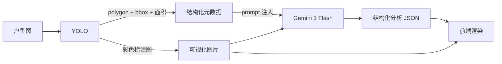

# Agent 模块设计报告

> 分支：`feature/agent` · 仅讨论 `apps/web-backend/agent.py` 及相关的 LLM 交互设计

---

## 1. 诚实地说：这不是一个"Agent"

严格意义上，我们做的不是一个 AI Agent。Agent 的核心特征——**自主决策链、工具调用、多步推理、记忆上下文**——当前实现都没有。

实际架构是一个 **两段式 Pipeline**：

```
输入图片 → [阶段1: YOLO 分割] → 房间结构化数据 + 标注图
                              → [阶段2: 多模态 LLM] → 分析结果 JSON
                                                        → [前端渲染]
```

LLM 在这个链路里的角色是**一次性分析器**：接收一张标注图 + 元数据，输出一份结构化分析。没有循环、没有工具、没有自主决策。

那为什么还叫 `feature/agent`？因为这是项目初期命名，且后续可以在这个基础上扩展成真正的 Agent（见 §5）。

---

## 2. 设计动机：为什么需要两段？

### 2.1 YOLO 能做什么、不能做什么

| 能力 | 能 | 不能 |
|------|:--:|:---:|
| 像素级分割 | ✅ 多边形精确到 0.01px | — |
| 房间分类 | — | ❌ 只知道这是 "room"，不知道是客厅还是卧室 |
| 装修建议 | — | ❌ 完全没有语义理解 |

### 2.2 多模态 LLM 能做什么、不能做什么

| 能力 | 能 | 不能 |
|------|:--:|:---:|
| 看懂户型图语义 | ✅ "这是主卧，旁边是卫生间" | — |
| 输出装修建议 | ✅ 结合常识生成专业文案 | — |
| 输出像素坐标 | — | ❌ 给不出精确 polygon |
| 数房间准确 | — | ❌ 直接看原图容易漏数/重数 |

### 2.3 结论

两段互补：YOLO 管精度，LLM 管语义。缺哪一个都不完整。



---

## 3. Prompt 设计

这是整个"agent"模块最核心的部分。LLM 输出的质量完全取决于 prompt。

### 3.1 完整 System Prompt

```
你是一个资深室内设计师和户型分析专家。

用户会给你一张经过AI分割标注的户型平面图。图中用不同颜色标记了各个
房间区域，并用 "Room 1", "Room 2" 等文字标签标注在对应区域上。

请仔细观察图片，为每个被标记为 Room N 的房间提供专业分析，并给出整体评价。
```

### 3.2 设计要点

**① 角色锚定**

`资深室内设计师和户型分析专家` —— 不是通用助手。这个角色设定让 LLM 调用室内设计领域的知识（家具尺寸常识、动线逻辑、采光判断），而不是泛泛而谈。

**② 关键约束：Room N 标签**

标注图上已经用 `Room 1`, `Room 2` ... 文字标注了每个房间。prompt 里明确说"为每个被标记为 Room N 的房间"，强制 LLM 把文字标签和图片中的位置一一对应。这是连接 YOLO 输出和 LLM 输出的桥梁——前端通过 `room_label: "Room 1"` 把 LLM 的分析匹配回对应的 polygon。

**③ 结构化输出约束**

给出完整 JSON Schema 示例 + 字段级注释，不做 "请用 JSON 格式" 这种模糊指令。具体到：

- `rating`: S / A+ / A / A- / B+ / B / C 七级枚举（不给模糊空间）
- `scores`: 0-100 整数，四个维度
- `suggestions`: 每个字段 60 字以内
- `analysis`: 100 字以内整体评价

**④ User Message 元数据注入**

在 user message 里注入 YOLO 的元数据作为先验提示：

```
AI已检测到以下房间区域：
Room 1: 面积占比 0.05, 置信度 0.98
Room 2: 面积占比 0.017, 置信度 0.97
...
```

这有两个作用：
- 告诉 LLM "这些房间确实存在"（不用自己判断是不是房间）
- 面积占比帮助 LLM 判断房间类型（大面积的房间更可能是客厅/主卧，小面积的更可能是卫生间/阳台）

### 3.3 容错策略

LLM 输出不可靠是常态，三层兜底：

| 层级 | 问题 | 处理 |
|------|------|------|
| 格式 | 输出包裹在 ````json ... ```` 里 | 正则剥离代码块标记 |
| 解析 | JSON 语法错误（漏逗号、多余文字） | `JSONDecodeError` 捕获，原文塞进 `overall_assessment`，其他字段给空默认值 |
| 字段缺失 | `scores` / `pros` / `cons` 为 null | 前端 `\|\| {}` `\|\| []` `\|\| "未知"` 防御 |

```python
def _parse_response(self, content: str) -> dict:
    text = content.strip()
    if text.startswith("```json"): text = text[7:]
    elif text.startswith("```"):   text = text[3:]
    if text.endswith("```"):       text = text[:-3]

    try:
        return json.loads(text.strip())
    except json.JSONDecodeError:
        return {
            "rating": "N/A",
            "house_type": "未知",
            "overall_assessment": content,  # 至少保留原文
            "pros": [], "cons": [],
            "scores": {}, "core_issues": [],
            "rooms": [], "overall_suggestions": "",
        }
```

---

## 4. LLM 交互参数

```python
response = self.client.chat.completions.create(
    model="gemini-3-flash-preview",
    messages=[
        {"role": "system", "content": SYSTEM_PROMPT},
        {
            "role": "user",
            "content": [
                {"type": "text", "text": user_text},
                {"type": "image_url", "image_url": {
                    "url": f"data:image/jpeg;base64,{image_base64}"
                }},
            ],
        },
    ],
    max_tokens=4096,
    temperature=0.7,
)
```

| 参数 | 值 | 理由 |
|------|------|------|
| `model` | `gemini-3-flash-preview` | 成本极低、中文好、多模态强 |
| `max_tokens` | 4096 | 6 个房间 × 4 条建议 + 评分 + 评价，需要一定输出长度 |
| `temperature` | 0.7 | 装修建议需要一定创造性，但也不能太飘（0.9 会乱编户型） |
| 图片格式 | `data:image/jpeg;base64,...` | 无需额外上传步骤，请求自包含 |

---

## 5. 如果要升级为真正的 Agent

当前是 Pipeline，后续可以朝以下方向演进为真正的 Agent：

### 5.1 工具调用（Tool Use）

```
Agent 拿到 YOLO 结果后：
  → 调用工具 "measure_room" 计算每个房间精确面积
  → 调用工具 "check_building_code" 检查是否符合建筑规范
  → 调用工具 "search_furniture" 搜索适配尺寸的家具
  → 汇总后给出建议
```

### 5.2 多步推理（Chain of Thought）

```
Step 1: 先判断户型类型（一室/两室/三室）
Step 2: 再逐个房间分析（面积、朝向、邻接关系）
Step 3: 动线分析（从玄关到各房间的路径）
Step 4: 综合建议（基于以上所有分析的结论）
```

### 5.3 交互式对话

```
用户: "主卧太小了，能怎么改？"
Agent: 回顾之前分析的主卧数据 → 针对性给改造方案
       → "可以把主卧和隔壁次卧的隔墙打掉..."
```

### 5.4 记忆上下文

```
用户上传户型A → Agent 记住 → 用户上传户型B
→ Agent: "和您上一个户型相比，这个厨房更大，但客厅采光更差..."
```

---

## 6. 总结

当前 `agent.py` 做的事情本质上是：

> **一个精心设计的 Prompt Template + 一张标注图 + 一段 YOLO 元数据**
> → **喂给多模态 LLM** → **拿到结构化分析 JSON** → **前端渲染**

它不复杂，但 Prompt 设计和容错处理是实际工程中真正有讲究的地方。名字叫 "Agent" 是因为项目初期的命名惯性——真正符合 Agent 定义的特性（自主决策、工具调用、多步推理）是后续可以添加的，而且当前的两段式架构已经为这些扩展留好了接口。
