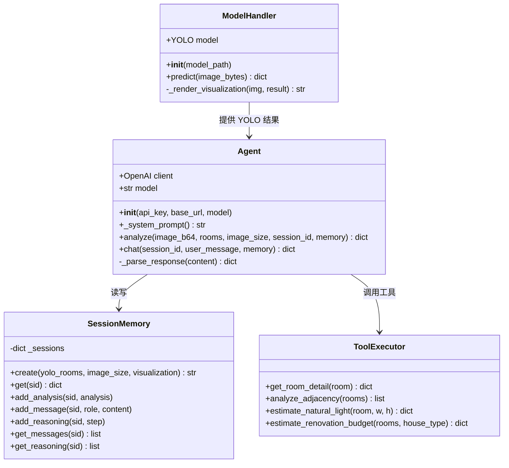
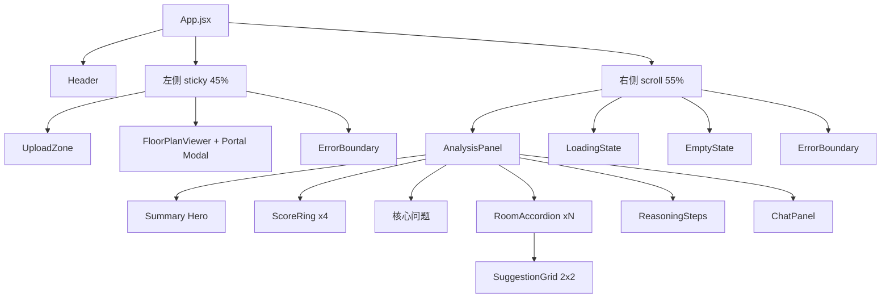
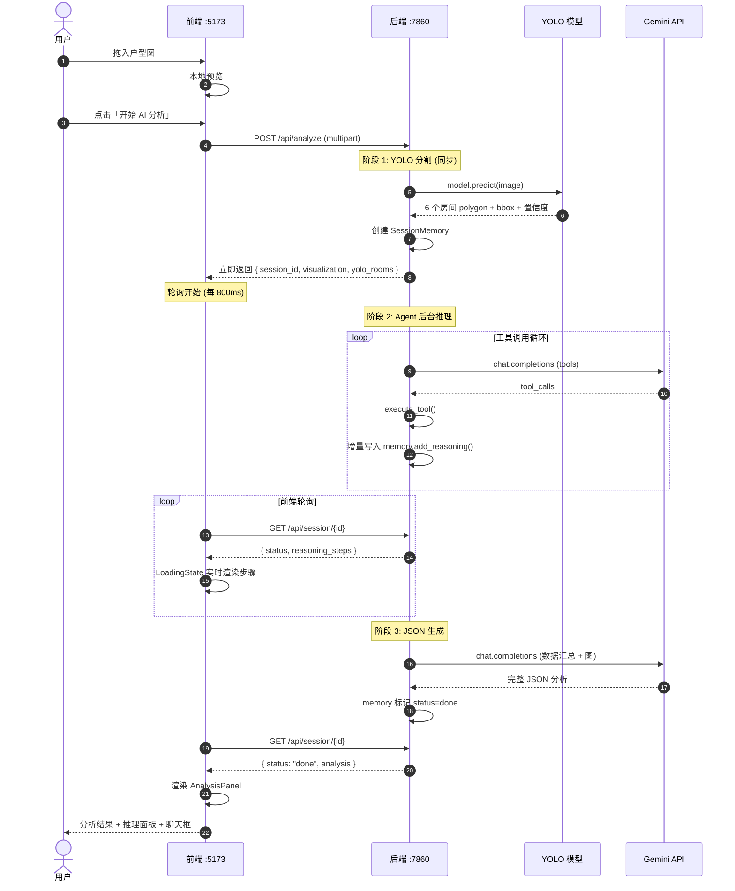
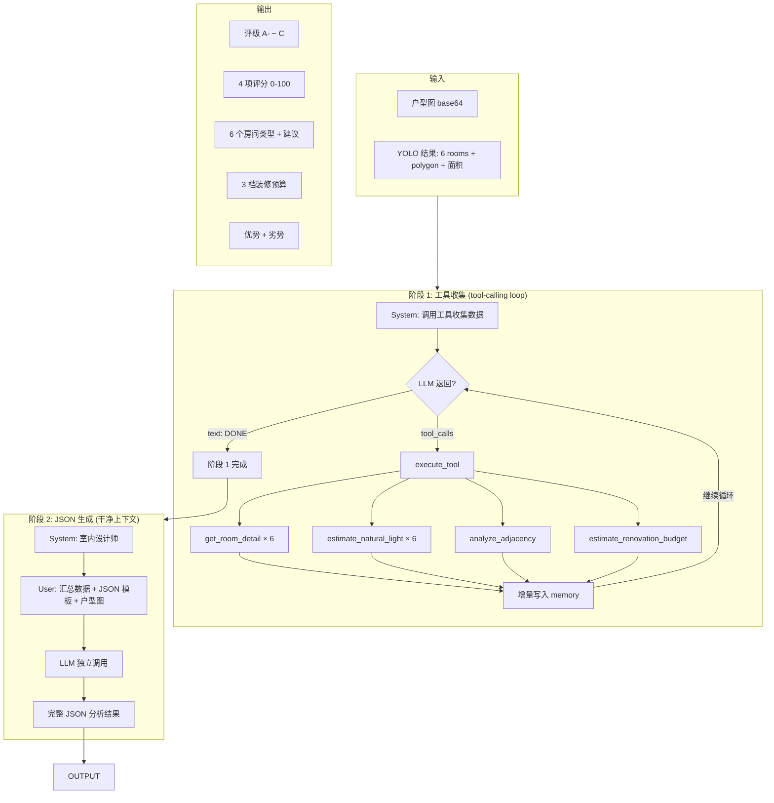
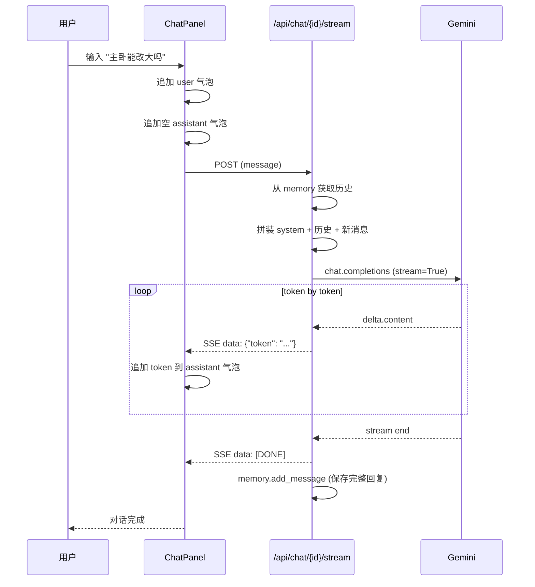
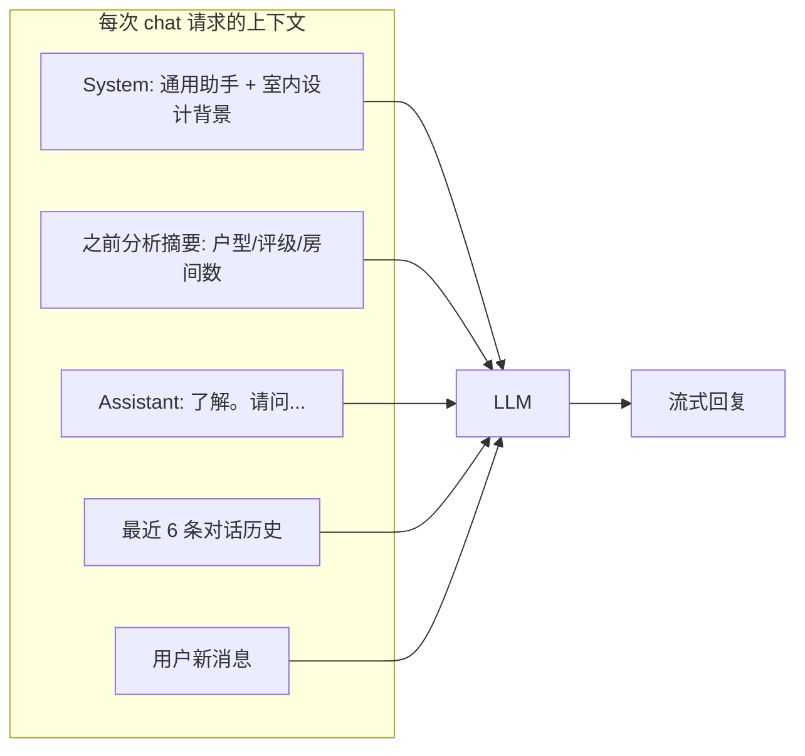
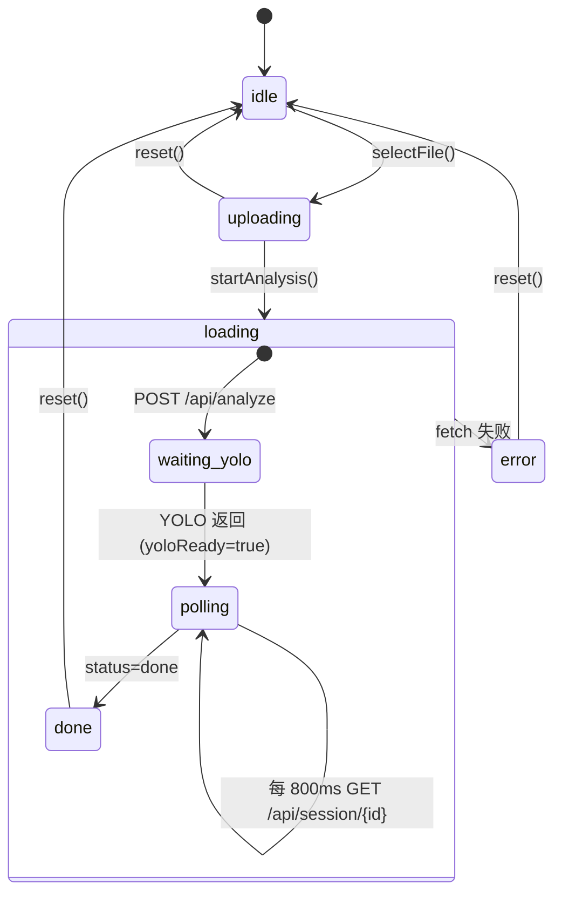

# Agent 架构与流程报告

> 分支：`feature/agent` · 覆盖 `apps/web-backend/` + `apps/web-frontend/`

---

## 1. 代码架构总览

```
apps/
├── web-backend/                    # FastAPI 后端
│   ├── main.py                     # 入口：路由 + 后台线程 + SSE 流式
│   ├── model_handler.py            # YOLO 模型封装（推理 + 可视化）
│   ├── agent.py                    # Agent 核心：两阶段推理 + 工具循环 + 对话
│   ├── tools.py                    # 4 个工具：定义 + 执行器
│   ├── memory.py                   # 会话记忆：SessionMemory 类
│   ├── requirements.txt
│   └── .env                        # API key / 模型路径（gitignored）
│
├── web-frontend/                   # React 19 + Vite 8 + Tailwind v4
│   ├── src/
│   │   ├── App.jsx                 # 顶层双栏布局
│   │   ├── index.css               # Tailwind + 背景渐变
│   │   ├── hooks/
│   │   │   └── useAnalysis.js      # 状态机 + 轮询 hook
│   │   └── components/
│   │       ├── Header.jsx          # 顶栏
│   │       ├── UploadZone.jsx      # 拖拽上传
│   │       ├── FloorPlanViewer.jsx # 户型图 + 工具栏 + Portal 全屏
│   │       ├── AnalysisPanel.jsx   # 分析结果容器（Hero/评分/房间/推理/聊天）
│   │       ├── LoadingState.jsx    # 实时推理步骤展示
│   │       ├── ReasoningSteps.jsx  # 推理步骤可折叠面板
│   │       ├── ScoreRing.jsx       # SVG 环形评分
│   │       ├── RoomAccordion.jsx   # 房间折叠卡片
│   │       ├── SuggestionGrid.jsx  # 2×2 建议网格
│   │       ├── ChatPanel.jsx       # 流式对话面板
│   │       ├── EmptyState.jsx      # 空 / 错误状态
│   │       └── ErrorBoundary.jsx   # 渲染错误边界
│   └── vite.config.js              # Tailwind 插件 + API 代理
```

### 1.1 后端类图

后端由四个核心模块构成，各司其职：

- **ModelHandler**：封装 YOLO 模型的加载与推理。启动时一次性加载 `best.pt`，提供 `predict()` 方法接收图片字节流，返回房间 polygon / bbox / 置信度，并调用 OpenCV + matplotlib 渲染彩色分割叠层图。
- **Agent**：系统的智能核心。持有 OpenAI 客户端，对外暴露三个接口：`analyze()` 执行两阶段推理分析，`chat()` 处理多轮对话，`_parse_response()` 负责从 LLM 的原始输出中提取 JSON（剥离 markdown 代码块、容错兜底）。
- **SessionMemory**：基于内存字典的会话存储。每个会话有唯一 ID，存储 YOLO 结果、分析历史、对话消息、推理步骤。支持增量写入，是前后端之间"实时可见性"的关键桥梁。
- **ToolExecutor**：四个工具的集合，被 Agent 在推理过程中调用。每个工具接收结构化参数，返回 JSON 字符串结果。



### 1.2 前端组件树



---

## 2. Agent 完整流程

### 2.1 端到端时序

从用户上传到看到结果，全链路分为三个异步阶段：

**阶段 1 — YOLO 分割（同步，~1s）**：用户点击"开始分析"后，前端 POST 图片到 `/api/analyze`。后端立即调用 YOLO 推理，创建会话，将分割结果（visualization base64 + yolo_rooms）即刻返回给前端。此时左侧户型图已经可见。

**阶段 2 — Agent 推理（异步，~15-30s）**：后端启动后台线程运行 Agent 分析，主线程不阻塞。Agent 反复调用 LLM（带工具定义），LLM 返回 `tool_calls` → 后端执行工具 → 结果追加到对话 → 继续循环，直到 LLM 回复 "DONE"。每次工具调用后，推理步骤增量写入 `SessionMemory`。

**前端轮询**：在阶段 2 进行期间，前端每 800ms 请求 `GET /api/session/{id}`，获取最新的 `reasoning_steps`，`LoadingState` 组件实时渲染工具名称和结果摘要。

**阶段 3 — JSON 生成（~5-10s）**：工具收集完成后，Agent 启动全新的 LLM 调用（干净上下文），传入汇总数据 + JSON 模板 + 户型图，要求 LLM 输出完整的结构化分析 JSON。生成后标记 `status=done`，前端下一次轮询拿到完整 `analysis`，切换为 `AnalysisPanel` 渲染。



### 2.2 Agent 两阶段推理

为什么要把推理拆成两阶段？初始设计是"把工具定义和 JSON 格式要求放在同一个 prompt 里，让 LLM 一边调工具一边输出 JSON"。实践中发现两个问题：

1. **上下文污染**：每轮工具调用会产生大量 assistant + tool 消息，这些消息会留在对话历史中。当 LLM 最终要输出 JSON 时，上下文窗口已经被十几条工具消息占满，导致 JSON 输出为空。
2. **注意力分散**：LLM 在同一个对话中既要决定调用哪个工具，又要记住 JSON schema 的每一个字段。实际表现为工具调用正确但 JSON 格式残缺。

两阶段方案把这两个任务拆到两个独立的 LLM 调用中：

**阶段 1 — 工具收集**：System prompt 只要求"调用工具收集数据"，不要求 JSON 输出。LLM 自主决定调用顺序和次数（实际运行中约 14-16 次工具调用），每次的结果通过 `memory.add_reasoning()` 增量写入，前端轮询可见。收集完毕后 LLM 回复 "DONE"。

**阶段 2 — JSON 生成**：全新的 `chat.completions.create` 调用，System prompt 切换为"室内设计师"。消息中只包含三样东西：阶段 1 汇总的数据（精简到 3000 字符以内）、JSON 模板、户型图。没有工具消息污染，LLM 可以专注于生成结构化输出。实际测试中这个阶段可靠地生成 2000+ 字符的完整 JSON。



### 2.3 为什么分两阶段？

| 对比 | 单次调用 | 两阶段 |
|------|:---:|:---:|
| 工具调用上下文 | 与 JSON 生成混在一起 | 阶段 1 专用，短上下文 |
| JSON 生成上下文 | 被工具调用消息污染 | 阶段 2 独立，干净上下文 |
| 实时可见性 | 用户等到最后才看到结果 | 阶段 1 每步增量写入 memory → 前端实时展示 |
| 容错 | 一处失败全丢 | 阶段 1 数据已落盘，阶段 2 可重试 |

---

## 3. 工具调用系统

### 3.1 四个工具

| 工具 | 输入 | 输出 | 用途 |
|------|------|------|------|
| `get_room_detail` | room_index | 面积、形状、尺寸标签 | LLM 判断房间类型 |
| `analyze_adjacency` | — | 所有房间对的邻接关系 | LLM 分析动线 |
| `estimate_natural_light` | room_index | 采光评分 0-100 + 等级 | LLM 评估采光 |
| `estimate_renovation_budget` | house_type | 简装/精装/豪装预算 | LLM 给装修建议 |

### 3.2 工具调用循环

工具调用是 Agent 区别于普通 Pipeline 的核心特征。在这个循环中，LLM 扮演决策者，后端扮演执行者：

1. **发起请求**：后端向 LLM 发送带有 `tools` 定义的消息（`tool_choice="auto"`），LLM 检查当前上下文后决定是否需要调用工具。
2. **并行调用**：LLM 在单次响应中可同时返回多个 `tool_calls`。例如第一次迭代通常包含 6 个 `get_room_detail`（每个房间一个）+ 6 个 `estimate_natural_light` + 1 个 `analyze_adjacency`，共 13 个并行调用。
3. **后端执行**：`execute_tool()` 分发到对应的 Python 函数，返回 JSON 字符串。结果同时做两件事：(a) 作为 `tool` 角色的消息追加到 LLM 对话历史，(b) 通过 `memory.add_reasoning()` 增量写入会话，供前端轮询展示。
4. **循环判断**：LLM 收到工具结果后继续推理。如果还需要更多数据（例如先拿到房间详情后再决定调预算工具），会继续返回 `tool_calls`。如果认为数据足够，返回纯文本 "DONE"，循环结束。
5. **上限保护**：最多 7 轮迭代，防止无限循环。

在实际运行中，LLM 通常用 2-3 轮完成所有工具调用：第 1 轮大规模收集（房间详情 + 采光 + 邻接），第 2 轮基于第 1 轮结果调预算工具，第 3 轮确认完成。

```mermaid
flowchart LR
    LLM[LLM] -->|tool_calls: [... 4 functions ...]| BE[后端]
    BE -->|execute_tool| T1[get_room_detail]
    BE -->|execute_tool| T2[analyze_adjacency]
    BE -->|execute_tool| T3[estimate_natural_light]
    BE -->|execute_tool| T4[estimate_renovation_budget]
    T1 & T2 & T3 & T4 -->|JSON result| MSG[追加到 messages]
    MSG -->|继续| LLM
    LLM -->|content: DONE| END[进入阶段 2]
```

### 3.3 工具执行代码路径

```
agent.py: analyze()
  └─ for iteration in range(1, 8):
       └─ client.chat.completions.create(tools=TOOL_DEFINITIONS)
            └─ msg.tool_calls → for tc in msg.tool_calls:
                 └─ tools.py: execute_tool(name, args, context)
                      └─ 返回 JSON string
                 └─ memory.add_reasoning(session_id, step)  ← 增量写入
```

---

## 4. 流式对话

### 4.1 SSE 流式端点

```
POST /api/chat/{session_id}/stream
  Content-Type: multipart/form-data
  参数: message (string)

Response: text/event-stream
  data: {"token": "主"}
  data: {"token": "卧"}
  data: {"token": "可"}
  data: {"token": "以"}
  ...
  data: [DONE]
```

### 4.2 流式时序



### 4.3 对话上下文管理



---

## 5. 前端状态机



---

## 6. 关键技术决策

| 决策 | 选择 | 原因 |
|------|------|------|
| Agent 推理与 YOLO 分离 | 后台线程 + 前端轮询 | YOLO ~1s，Agent ~15-30s，用户先看到分割结果 |
| 两阶段 Agent | 先收集数据再生成 JSON | 避免工具调用污染 JSON 生成的上下文 |
| 增量写入 memory | `add_reasoning` 在每次工具调用后立即调用 | 前端轮询能实时看到推理步骤 |
| `max_completion_tokens` | 替代 `max_tokens` | Gemini 3 Flash 不响应 `max_tokens`，导致输出为空 |
| SSE 流式对话 | Server-Sent Events | 逐 token 推送，用户不用等完整回复 |
| Portal 渲染全屏预览 | `createPortal` to `document.body` | 避免 sticky 容器 stacking context 遮挡 modal |
| ErrorBoundary | 包裹左右面板 | 渲染错误不白屏，显示具体错误信息 |

---

## 7. 总结

Agent 模块从最初的"两段式 Pipeline"升级为具备**工具调用、多步推理、流式对话、会话记忆**四个能力的 AI Agent：

```
v1:  YOLO → 一次性 Prompt → LLM → JSON → 前端
v2:  YOLO → Phase1 工具循环 → Phase2 JSON 生成 → 前端轮询 → 实时推理展示
        └─ ChatPanel ← SSE 流式 ← /api/chat/{id}/stream
        └─ SessionMemory → 多轮对话上下文
```
