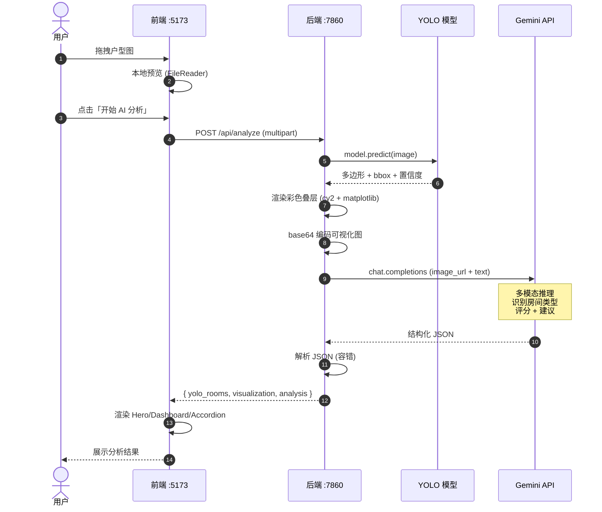
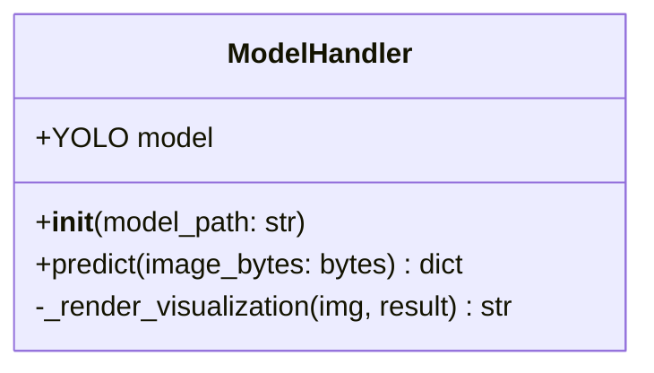
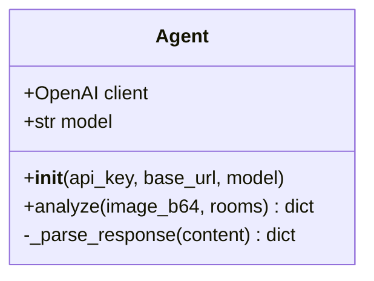
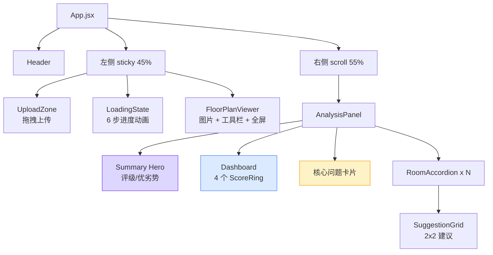
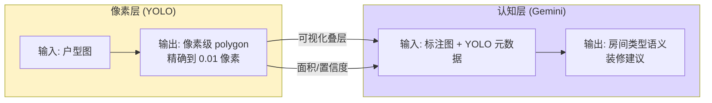
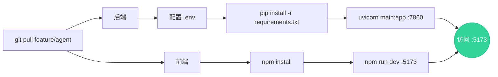

# ODPlatform Agent 技术报告

> AI 户型分析模块技术设计与实现报告
>
> 分支：`feature/agent` · 模块：`apps/web-backend` + `apps/web-frontend`

---

## 1. 项目背景与目标

### 1.1 业务目标

为 ODPlatform 添加面向终端用户的 AI 智能体（Agent），实现：

> **用户拖入一张户型图 → AI 自动识别房间区域 → 给出专业装修建议与户型评分**

### 1.2 设计约束

| 约束 | 说明 |
|------|------|
| 不破坏组长仓库 `main` 分支 | 仅在 `apps/` 下新增独立模块，不修改核心包 `apps/platform/src/odp_platform/` |
| 与小组其他成员的训练成果对接 | 直接复用 `代码/best.pt`（YOLO11 实例分割权重） |
| 后续 Day6/Day7/Day8 可继续平行开发 | Agent 自包含、零依赖核心模块 |
| 单机可跑 | 后端 FastAPI、前端 Vite，均可本地启动 |

---

## 2. 整体架构

### 2.1 系统架构图（Mermaid）

```mermaid
graph TB
    subgraph Browser["🌐 浏览器 (用户端)"]
        UI[React 19 + Vite UI]
        UI -->|拖拽上传| Upload[UploadZone]
        UI -->|展示| Viz[FloorPlanViewer]
        UI -->|展示| Panel[AnalysisPanel]
    end

    subgraph Backend["⚙️ 后端 FastAPI :7860"]
        API[/api/analyze 路由]
        MH[ModelHandler<br/>YOLO 推理]
        AG[Agent<br/>多模态分析]
        API --> MH
        MH --> AG
    end

    subgraph External["☁️ 外部服务"]
        Gemini[Gemini 3 Flash<br/>via 中转 API]
    end

    subgraph Local["💾 本地资源"]
        Weights[best.pt<br/>YOLO11 分割权重]
    end

    Upload -->|POST multipart| API
    API -->|JSON 结果| Panel
    API -->|base64 可视化图| Viz
    MH -.加载.-> Weights
    AG -->|OpenAI 兼容协议| Gemini
    Gemini -->|结构化 JSON| AG

    style Gemini fill:#a78bfa,stroke:#7c3aed,color:#fff
    style Weights fill:#fbbf24,stroke:#f59e0b,color:#fff
    style API fill:#34d399,stroke:#10b981,color:#fff
```

### 2.2 数据流时序图（Mermaid）



---

## 3. 技术选型

### 3.1 后端

| 层 | 选型 | 选型理由 |
|------|------|----------|
| Web 框架 | **FastAPI** | 异步原生、自动 OpenAPI、与 Python 生态无缝衔接 |
| ASGI 服务 | **uvicorn** | 性能高、热重载方便开发 |
| 模型推理 | **ultralytics (YOLO11)** | 与训练同学使用的库一致，直接加载 `.pt` 权重 |
| 图像处理 | **OpenCV + matplotlib** | OpenCV 处理像素，matplotlib 提供柔和调色板 |
| LLM SDK | **openai >=1.50** | OpenAI 兼容协议，可对接任意中转 API |
| 配置 | **python-dotenv** | API key 走 `.env`，不进 git |

### 3.2 前端

| 层 | 选型 | 选型理由 |
|------|------|----------|
| 框架 | **React 19** | 团队熟悉、组件化最成熟 |
| 构建 | **Vite 8** | HMR 快、配置简单、原生支持代理 |
| 样式 | **Tailwind CSS v4** | 原子化类、统一 spacing system |
| 动画 | **Framer Motion** | stagger、AnimatePresence、SVG 路径动画 |
| 图标 | **Lucide React** | 开源、风格一致、tree-shakable |

### 3.3 为什么选 Gemini 3 Flash 而不是 GPT-4o？

| 维度 | Gemini 3 Flash | GPT-4o |
|------|:---:|:---:|
| 多模态能力 | ✅ 强 | ✅ 强 |
| 价格 | ⭐ 极低 | 中等 |
| 中文理解 | ✅ 好 | ✅ 好 |
| 结构化 JSON 输出稳定性 | ✅ 稳定 | ✅ 稳定 |
| 中转 API 可达性 | ✅ ikuncode.cc 支持 | ✅ 支持 |

**最终选择**：成本敏感场景下，Gemini 3 Flash 性价比最优。

---

## 4. 核心模块设计

### 4.1 后端模块结构

```
apps/web-backend/
├── main.py              # FastAPI 入口，路由 + 静态文件
├── model_handler.py     # 封装 YOLO 推理与可视化
├── agent.py             # 封装 LLM 多模态调用
├── requirements.txt
└── .env                 # 环境变量（gitignored）
```

### 4.2 关键类与职责

#### ModelHandler（`model_handler.py`）



**职责**：
- 加载 `best.pt` 权重（启动时一次，避免每次请求重载）
- 接收原始图片字节流，调用 `model.predict()`
- 提取 bbox、polygon、置信度、面积占比
- 用 `Pastel1` 调色板渲染半透明彩色叠层 + Room N 标签
- 返回 base64 编码的可视化图 + 房间结构化数据

#### Agent（`agent.py`）



**职责**：
- 构造 system + user 多模态消息（图片 + YOLO 元数据上下文）
- 强 prompt 约束输出 JSON 格式（评级 / 优劣势 / 评分 / 房间分析 / 建议）
- 容错解析：剥离 `\`\`\`json` 代码块、JSONDecodeError 兜底返回原文

### 4.3 前端组件树（Mermaid）



### 4.4 状态管理

使用自定义 hook `useAnalysis()` 集中管理状态机：

```
       ┌──────┐  selectFile  ┌──────────┐  startAnalysis  ┌────────┐
   ┌──>│ idle │─────────────>│uploading │────────────────>│loading │
   │   └──────┘              └──────────┘                 └────┬───┘
   │                                                           │
   │                                              fetch ok ┌───┴───┐
   │                                                       ▼       ▼
   │                                                 ┌──────┐ ┌──────┐
   └─────────── reset ◄────────────────────────────┐ │ done │ │error │
                                                   │ └──────┘ └──────┘
                                                   └──────────────┘
```

---

## 5. AI Agent 设计

### 5.1 为什么需要 YOLO + LLM 双层？



**核心洞察**：LLM 看图能给"客厅 / 卧室"的语义判断，但**给不出像素级 polygon**；YOLO 能给精确 polygon，但**不知道这是什么房间**。两层互补。

### 5.2 Prompt 工程

System prompt 关键设计点：

1. **角色锚定**：`资深室内设计师和户型分析专家`
2. **任务约束**：`为每个被标记为 Room N 的房间提供专业分析`（让 LLM 把 "Room 1" 标签和图中位置对应起来）
3. **输出格式强约束**：完整 JSON Schema 示例 + 字段说明 + 字段级注意事项
4. **评级体系**：S / A+ / A / A- / B+ / B / C 七级，避免 LLM 给"中等""一般"等模糊输出
5. **字数限制**：建议 60 字、整体评价 100 字、优化建议 150 字 → 强制信息密度

### 5.3 容错策略

| 故障 | 兜底 |
|------|------|
| LLM 返回带 `\`\`\`json` 包裹 | `_parse_response` 自动剥离 |
| LLM 返回非 JSON 文本 | `JSONDecodeError` 捕获，把原文塞进 `overall_assessment` |
| LLM 漏字段 | 前端用 `\|\| []` `\|\| 0` `\|\| "未知"` 容错渲染 |
| LLM API 超时/4xx | FastAPI 抛 500，前端切 `error` 状态显示 |

---

## 6. 视觉设计系统

### 6.1 设计原则

| 原则 | 实现 |
|------|------|
| **背景层级** | 不用纯灰 → `radial-gradient` 双光源（紫 + 蓝）+ `#f5f7fb` 底色 |
| **玻璃拟态** | 卡片 `rgba(255,255,255,0.55)` + `backdrop-filter: blur(12px)` |
| **主次分离** | Hero 用紫色渐变 + 紫边框；普通卡片用半透明白；问题卡片用暖黄 |
| **Spacing 系统** | 4 / 8 / 12 / 16 / 20 / 24，禁用零散值 |
| **字体层级** | 标签 `text-xs uppercase tracking-wide` / 标题 `font-semibold tracking-tight` / 正文 `text-[13px] leading-relaxed` |
| **色彩语义** | 评分: 绿 ≥80 / 黄 ≥60 / 红 <60；评级: 紫 / 绿 / 蓝 / 灰 |

### 6.2 关键交互动画

| 元素 | 动画 |
|------|------|
| 卡片入场 | `opacity 0→1` + `y 16→0`，stagger `0.06s × index` |
| 评分环 | SVG `strokeDashoffset` 1s 缓出动画 |
| Accordion 展开 | `height 0→auto` + `opacity 0→1`，0.2s |
| 加载状态 | 6 步逐条点亮，`Circle` 脉冲缩放 |
| 图片预览 | hover 缩放 110%、点击 Portal 全屏 + 工具栏 |

---

## 7. API 设计

### 7.1 接口规范

```
POST /api/analyze
Content-Type: multipart/form-data

Request:
  file: image/jpeg | image/png

Response: 200 OK
  application/json
```

### 7.2 响应数据结构

```typescript
{
  image_size: { width: number, height: number },
  visualization: string,        // base64 JPEG
  yolo_rooms: [{
    id: number,
    bbox: { x1, y1, x2, y2 },
    polygon: number[][],        // 多边形顶点
    area_ratio: number,         // 0-1
    confidence: number          // 0-1
  }],
  analysis: {
    rating: "S" | "A+" | "A" | "A-" | "B+" | "B" | "C",
    house_type: string,         // "两室一厅"
    overall_assessment: string,
    pros: string[],             // 3 条
    cons: string[],             // 2 条
    scores: {
      space_utilization: number,  // 0-100
      lighting: number,
      traffic_flow: number,
      storage_potential: number
    },
    core_issues: string[],
    rooms: [{
      room_label: "Room 1",
      room_type: "主卧",
      analysis: string,
      suggestions: {
        furniture: string,
        color: string,
        storage: string,
        lighting: string
      }
    }],
    overall_suggestions: string
  }
}
```

---

## 8. 部署与运行

### 8.1 启动流程



### 8.2 环境变量

```bash
# apps/web-backend/.env
LLM_API_KEY=sk-xxx
LLM_BASE_URL=https://api.ikuncode.cc/v1
LLM_MODEL=gemini-3-flash-preview
MODEL_PATH=path/to/best.pt
```

### 8.3 端口占用

| 端口 | 服务 |
|------|------|
| 7860 | FastAPI 后端 |
| 5173 | Vite 前端开发服务器（生产可用 `npm run build` 静态托管） |

---

## 9. 关键决策记录

### 9.1 为什么前端单独起一个 Vite 项目，而不是放进后端 `static/`？

- **HMR 体验**：Vite 改代码即时热更新，开发效率高
- **职责分离**：前端独立构建，将来可单独部署到 CDN
- **proxy 透明**：Vite 把 `/api/*` 自动代理到 :7860，开发期无 CORS 问题
- **生产兼容**：`npm run build` 出的 `dist/` 可直接被 FastAPI `StaticFiles` 托管

### 9.2 为什么用 Gemini 而不是开源多模态？

- **CPU 推理慢**：开源 Qwen-VL / LLaVA 在 CPU 上推理 30s+
- **效果差距**：开源模型对中文户型图理解能力弱
- **成本**：单次分析 < 0.001 元，相比开发与维护开源模型部署成本，性价比远高

### 9.3 为什么不让 LLM 直接看原图？

```
方案 A：用户原图 → LLM 直接分析
   ❌ 无 polygon → 前端无法画分割叠层
   ❌ LLM 数房间不准确（容易漏数/重数）

方案 B（采用）：原图 → YOLO 分割 → 标注图 + 元数据 → LLM
   ✅ 像素级精度由 YOLO 保证
   ✅ Room N 标签让 LLM 一一对应房间
   ✅ 元数据（面积/置信度）作为先验提示
```

---

## 10. 后续可优化方向

| 优先级 | 方向 | 说明 |
|:---:|------|------|
| P1 | LLM 流式输出 | 用 SSE 让分析结果逐字出现，体验类似 ChatGPT |
| P1 | 服务端缓存 | 同一张图重复上传走缓存，省 API 调用 |
| P2 | 图片裁剪/旋转 | 用户上传前可旋转 90° 校正方向 |
| P2 | 多模型对比 | 同时调 Gemini + Qwen-VL，让用户对比建议 |
| P3 | 历史记录 | 持久化用户分析记录，支持对比 |
| P3 | 协作分享 | 生成分析报告 PDF 或公开链接 |

---

## 11. 架构示意图（AI 生图 Prompt）

如需把 §2.1 架构图渲染为高质量插图，可使用以下 prompt 喂 Midjourney / DALL·E / 即梦等工具：

```
A clean, modern technical architecture diagram in flat design style.
Three vertical sections side by side:

LEFT (Browser layer): A laptop screen showing a React UI with a floor
plan image on left and analysis cards with score rings on right. Soft
purple-blue gradient accents.

CENTER (Backend layer): A box labeled "FastAPI :7860" containing two
sub-modules — a yellow "YOLO Inference" engine icon and a purple "Agent
LLM Orchestrator" icon. Arrows showing internal data flow.

RIGHT (External services): A cloud icon labeled "Gemini 3 Flash" with
soft glow.

Bottom: a yellow database cylinder labeled "best.pt — YOLO weights".

Connect with curved arrows showing data flow:
- Browser → FastAPI (POST multipart)
- FastAPI ↔ YOLO (load weights)
- FastAPI → Gemini (multimodal request)
- All return paths shown with dashed arrows.

Color palette: indigo-violet gradient (#7c3aed to #3b82f6),
soft pastel backgrounds, white cards with subtle shadows,
glass-morphism style. Minimalist, high-end SaaS dashboard aesthetic.
No text labels too small to read. 4K, vector style.
```

---

## 12. 总结

本模块以 **YOLO 视觉感知 + 多模态 LLM 认知** 的双层架构，把训练同学的模型成果包装成了**面向终端用户的 AI 产品**。

### 核心贡献

- ✅ 完整的前后端 + LLM 集成链路
- ✅ 现代化 AI SaaS 风格 UI（背景层级、玻璃拟态、Dashboard、过程动画）
- ✅ 健壮的容错与状态管理
- ✅ 文档完整、与组长 main 分支零冲突，可平滑合并

### 团队协作价值

| 角色 | 受益 |
|------|------|
| 训练同学 | 模型有了直观的可视化展示载体 |
| 后续 Day6/7/8 开发 | 不阻塞，平行推进核心模块 |
| 组长 | 增加产品演示亮点，PR 易合并 |
| 用户 | 真正可用的 AI 户型分析体验 |
